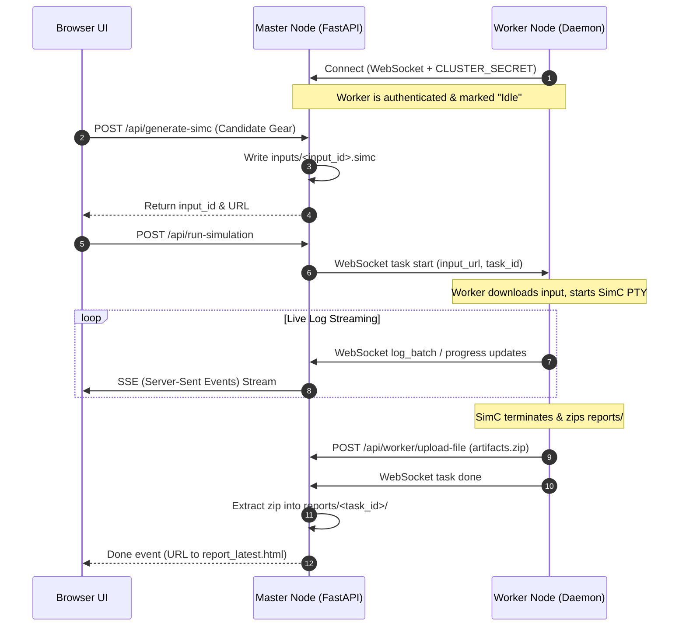

# System Architecture

Simcraft Helper operates in two modes:
1.  **Local Mode**: FastAPI web server and CLI tools run on the user's machine (standalone).
2.  **Distributed Mode**: Master FastAPI server coordinates and dispatches tasks to remote worker daemons.

---

## Component Overview

| Component | Path | Language/Tech | Description |
| :--- | :--- | :--- | :--- |
| **Web UI** | `src/web/static/` | HTML, CSS, JS | Paste addon text, select gear options/upgrades, review logs/reports. |
| **Master Node** | `src/web/main.py` | Python (FastAPI) | Serves UI, parses addons, saves tasks, acts as WebSockets master for workers. |
| **Worker Node** | `src/worker.py` | Python (Asyncio) | WebSocket worker. Downloads tasks, runs SimC under a PTY, uploads report ZIPs. |
| **Deployer** | `utils/deploy.py` | Python (SSH/SCP) | Deploys PyInstaller binaries to remote hosts via systemd-user or `nohup`. |
| **Core Library** | `src/core/` | Python | Normalizes addon files, handles environment variables and safe directories. |

---

## Communication Lifecycle



---

## Runtime Storage Layout

```text
target_dir/ (e.g., /home/user/simc_helper)
├── bin/
│   ├── simc-master           # Compiled master executable
│   └── simc-worker           # Compiled worker daemon
├── logs/
│   ├── master.log            # Application logs
│   └── worker.log
├── data/
│   └── master/
│       ├── inputs/           # Generated .simc task inputs
│       └── simc_helper.sqlite# SQLite user/session storage
├── reports/ (or /tmp/simc_reports/)
│   └── <task_id>/            # Unzipped HTML reports & logs
└── thirdparties/
    └── simc/                 # SimulationCraft source and compiled binary
```

---

## Build Pipeline

CMake orchestrates PyInstaller to package Python source code and static assets into single-file binaries.

| Build Target | Executable | Output Path | Mode |
| :--- | :--- | :--- | :--- |
| `simc_master` | `simc-master` | `<build-dir>/simc-master` | FastAPI + static web assets bundled |
| `simc_worker` | `simc-worker` | `<build-dir>/simc-worker` | Daemon + manage_simc + sim_helper |
| `deploy_tool` | `deploy` | `<build-dir>/deploy` | Deploys master/worker nodes via SSH |
| `debug_cli` | `debug_cli` | `<build-dir>/debug_cli` | Queries cluster socket states |
| `package_all` | All of the above | `<build-dir>/` | Standard release compilation |
| `verified_package_all` | All of the above | `<build-dir>/` | Runs tests before packaging |

### Build Commands

```bash
# Standard Linux x86_64 compilation (runs PyInstaller in Docker)
cmake -S . -B build -DTARGET_PLATFORM=linux
cmake --build build --target package_all

# Rebuild with fresh pyinstaller caching
cmake -S . -B build -DPYINSTALLER_CLEAN=ON
cmake --build build --target package_all
```
